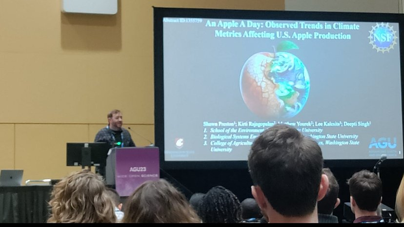

<link rel="stylesheet" href="style.css">

<nav>
  

    <a href="index.html">Home</a>
    <a href="portfolio.html">Portfolio</a>
    <a href="https://hazardapp.replit.app/">HazardApp</a>
  

</nav>

  

    
    <h2>Shawn Preston</h2>
    
shawnxpreston@gmail.com

    

      <a href="mailto:shawnxpreston@gmail.com"><button>Email</button></a>
      <a href="https://github.com/shawnatwsu"><button>GitHub</button></a>
      <a href="https://linkedin.com/in/shawnxprestonms"><button>LinkedIn</button></a>
      <a href="https://twitter.com/shawn_dabblez"><button>Twitter</button></a>
    

  

  

    <section>
      <h2>About Me</h2>
      

        I am a climate, remote sensing, and GIS scientist with an M.S. in Environmental Science.
        I have worked with <b>NASA, NOAA, USGS, and Washington State University</b>, analyzing hazards such as wildfire spread, extreme heat, stormwater events, and agricultural resilience.
      

      

        Based in the Pacific Northwest, I enjoy working with satellite data, building visualizations, and translating complex climate science into actionable insights.
      

    </section>

    <section>
      <h2>Education</h2>
      
<b>Washington State University</b>, Vancouver, WA 
      M.S. Environmental Science – July 2024 
      B.S. Environmental Science – May 2020

      
<b>Oregon State University</b>, Corvallis, OR 
      GIScience Graduate Certificate (Expected July 2025)

    </section>

    <section>
      <h2>Professional Experience</h2>
      
<b>NOAA – National Oceanic and Atmospheric Administration</b> 
      Physical Scientist (Student Trainee) | Jul 2024 – Feb 2025

      
<b>Washington State University</b> 
      Graduate Research Assistant | Jul 2022 – Jul 2024

      
<b>Sunshine Elite Education</b> 
      STEM Teacher & Knowledge Bowl Coach | Jan 2022 – Feb 2023

      
<b>NASA Marshall Space Flight Center</b> 
      GIS Student Intern | Jun 2021 – Jul 2021

      
<b>San Jose State University</b> 
      Graduate Teaching Assistant | Aug 2020 – May 2021

    </section>

    <section>
      <h2>Skills</h2>
      
<b>Programming:</b> Python, R, Google Earth Engine, JavaScript, SQL, Bash

      
<b>GIS & Remote Sensing:</b> ArcGIS Pro, QGIS, ENVI, NCL, CDO, Cartopy, GeoPandas

      
<b>Data Science:</b> Xarray, Pandas, Statsmodels, SciPy, Jupyter

      
<b>Visualization:</b> Matplotlib, Tableau, Dashboards, Story Maps

      
<b>Other Expertise:</b> Remote Sensing, Climate Data Analysis, HPC, Scientific Writing

    </section>
  

