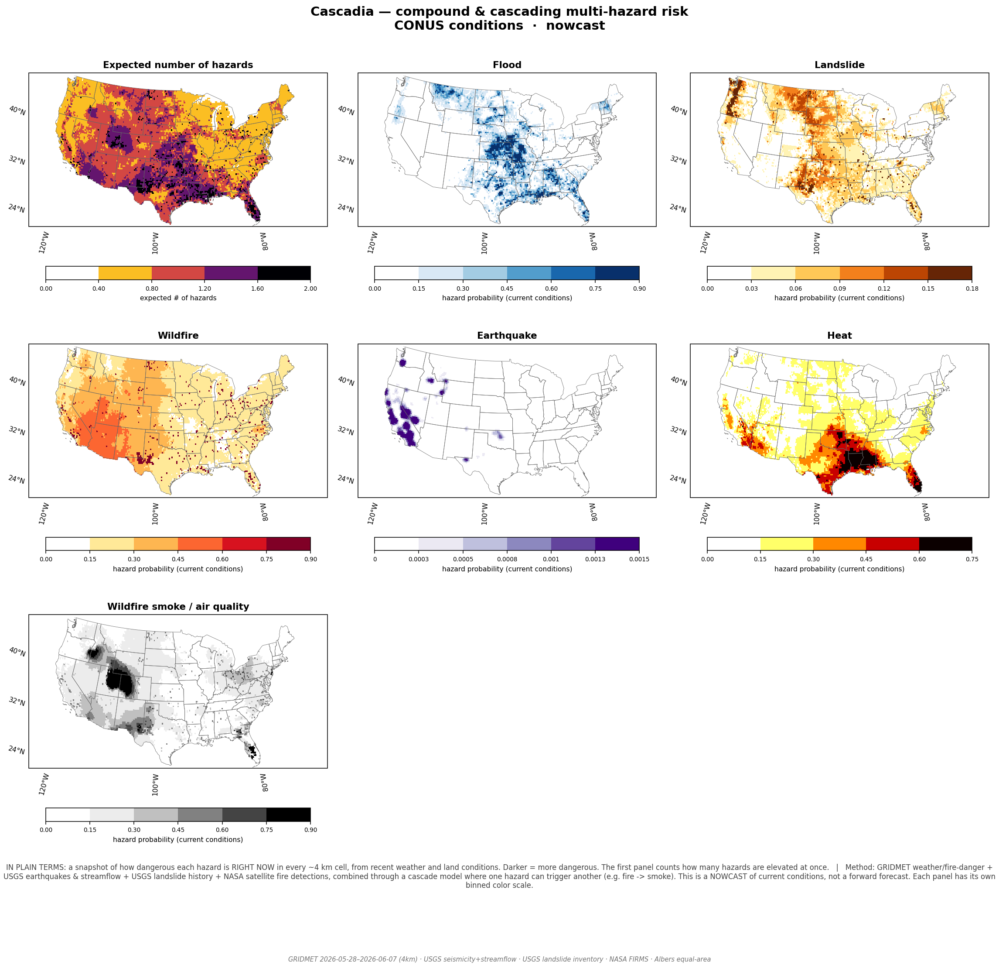
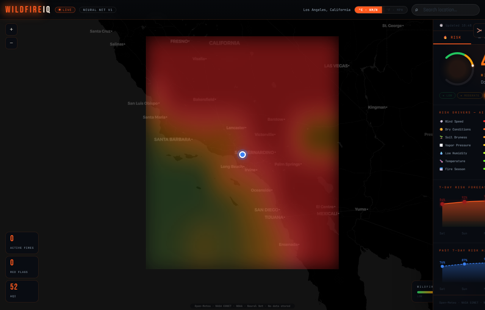
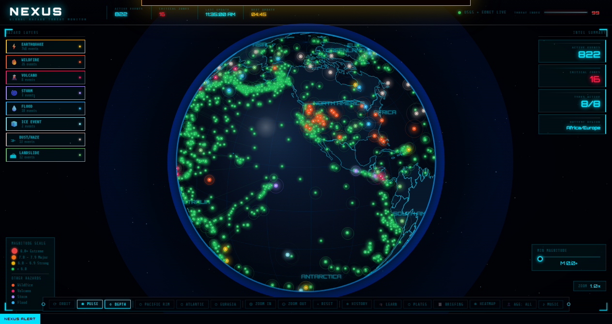
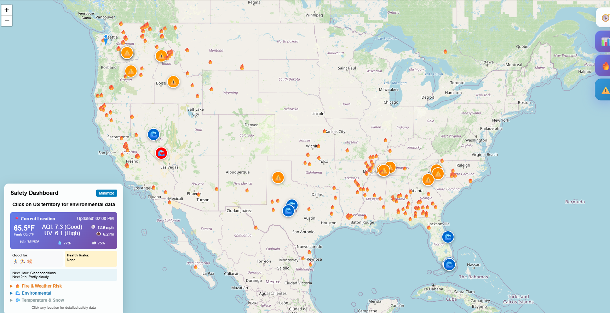
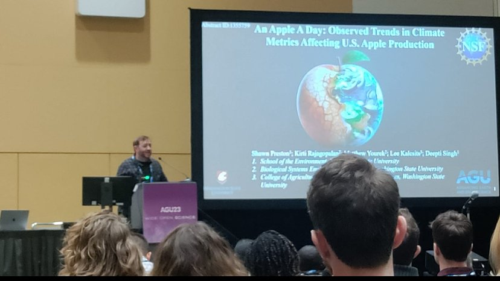

<link rel="stylesheet" href="style.css">
<link rel="stylesheet" href="https://fonts.googleapis.com/css2?family=Inter:wght@400;500;600&family=Space+Grotesk:wght@400;500;600;700&display=swap">

<header>
  

    
🌌 Shawn Preston

    

      <a href="index.html">Home</a>
      <a href="portfolio.html">Portfolio</a>
      <a href="cascadia.html">Cascadia</a>
      <a href="https://shawnatwsu.github.io/HazardApp/">HazardApp</a>
    

  

</header>

<!-- ===== Intro / research statement ===== -->

  
Early-Career Climate Scientist

  <h1 class="aurora">Shawn Preston</h1>
  
Climate, remote sensing &amp; GIS · M.S. Environmental Science

  

    I study how a changing climate reshapes natural hazards — wildfire, extreme heat, flooding, and
    their compounding effects — and build open tools that turn satellite and Earth-system data into
    decisions. Currently developing <a href="cascadia.html"><b>Cascadia</b></a>, an open-source
    compound multi-hazard engine for the entire United States.
  

<!-- ===== Recent projects — auto-scrolling band ===== -->

Recent work · the last few months

  

    <a class="marquee-card" href="cascadia.html">
      
      🌎 Cascadia
      Compound multi-hazard engine
    </a>
    <a class="marquee-card" href="https://shawnatwsu.github.io/wildfireiq/">
      
      🔥 WildfireIQ
      Live wildfire risk heatmap
    </a>
    <a class="marquee-card" href="https://shawnatwsu.github.io/nexus-hazard/">
      
      🛰️ NEXUS
      Real-time global hazard globe
    </a>
    <a class="marquee-card" href="https://shawnatwsu.github.io/HazardApp/">
      
      ⚡ HazardApp
      Hazard monitoring dashboard
    </a>

    <!-- duplicate set for a seamless loop -->
    <a class="marquee-card" href="cascadia.html" aria-hidden="true" tabindex="-1">
      
      🌎 Cascadia
      Compound multi-hazard engine
    </a>
    <a class="marquee-card" href="https://shawnatwsu.github.io/wildfireiq/" aria-hidden="true" tabindex="-1">
      
      🔥 WildfireIQ
      Live wildfire risk heatmap
    </a>
    <a class="marquee-card" href="https://shawnatwsu.github.io/nexus-hazard/" aria-hidden="true" tabindex="-1">
      
      🛰️ NEXUS
      Real-time global hazard globe
    </a>
    <a class="marquee-card" href="https://shawnatwsu.github.io/HazardApp/" aria-hidden="true" tabindex="-1">
      
      ⚡ HazardApp
      Hazard monitoring dashboard
    </a>

  

  <!-- Left Column -->
  

    
    <h2>Shawn Preston</h2>
    
M.S. Environmental Science Pacific Northwest, USA

    

      <a href="mailto:shawnxpreston@gmail.com"><button>Email</button></a>
      <a href="https://github.com/shawnatwsu"><button>GitHub</button></a>
      <a href="https://linkedin.com/in/shawnxprestonms"><button>LinkedIn</button></a>
      <a href="https://www.researchgate.net/publication/385719286_Changing_climate_risks_for_high-value_tree_fruit_production_across_the_United_States"><button>ResearchGate</button></a>
    

  

  <!-- Right Column -->
  

    <section class="reveal">
      <h2>About Me</h2>
      

        I am a climate, remote sensing, and GIS scientist with an M.S. in Environmental Science.
        I have worked with <b>NASA, NOAA, USGS, and Washington State University</b>, analyzing hazards such as wildfire spread, extreme heat, stormwater events, and agricultural resilience.
      

      

        Based in the Pacific Northwest, I work with satellite data, large climate ensembles, and
        open Earth-system feeds to study natural hazards and translate complex science into
        actionable insight. My current focus, <a href="cascadia.html"><b>Cascadia</b></a>, is an
        open-source compound multi-hazard engine for the entire US.
      

    </section>

    <section class="reveal">
      <h2>Research Interests</h2>
      <ul class="interest-list">
        <li>Compound &amp; cascading natural hazards (wildfire, heat, flood, smoke)</li>
        <li>Satellite remote sensing &amp; thermal/anomaly detection</li>
        <li>Climate impacts on agriculture &amp; large-ensemble projections</li>
        <li>Open, reproducible geospatial workflows for risk communication</li>
      </ul>
    </section>

    <section class="reveal">
      <h2>Selected Research &amp; Publications</h2>
      

        Preston, S. <i>Changing climate risks for high-value tree fruit production across the United States.</i>
        <a href="https://www.researchgate.net/publication/385719286_Changing_climate_risks_for_high-value_tree_fruit_production_across_the_United_States">ResearchGate ↗</a> ·
        <a href="https://github.com/shawnatwsu/Changing-Climate-Risks-for-High-Value-Tree-Fruit-Production-across-the-United-States">Code ↗</a>
      

      

        Preston, S. <i>Projected changes in climate conditions affecting U.S. apple production using large ensembles (CESM2-LE).</i>
        <a href="https://github.com/shawnatwsu/Projected-Changes-in-Climate-Conditions-Affecting-U.S.-Apple-Production-Using-Large-Ensembles">Code ↗</a>
      

    </section>

    <section class="reveal">
      <h2>Education</h2>
      
<b>Washington State University</b>, Vancouver, WA 
      M.S. Environmental Science – July 2024 
      B.S. Environmental Science – May 2020

      
<b>Oregon State University</b>, Corvallis, OR 
      GIScience Graduate Certificate (Expected July 2025)

    </section>

    <section class="reveal">
      <h2>Professional Experience</h2>
      
<b>NOAA – National Oceanic and Atmospheric Administration</b> 
      Physical Scientist (Student Trainee) | Jul 2024 – Feb 2025

      
<b>Washington State University</b> 
      Graduate Research Assistant | Jul 2022 – Jul 2024

      
<b>Sunshine Elite Education</b> 
      STEM Teacher & Knowledge Bowl Coach | Jan 2022 – Feb 2023

      
<b>NASA Marshall Space Flight Center</b> 
      GIS Student Intern | Jun 2021 – Jul 2021

      
<b>San Jose State University</b> 
      Graduate Teaching Assistant | Aug 2020 – May 2021

    </section>

    <section class="reveal">
      <h2>Skills</h2>
      
<b>Programming:</b> Python, R, Google Earth Engine, JavaScript, SQL, Bash

      
<b>GIS & Remote Sensing:</b> ArcGIS Pro, QGIS, ENVI, NCL, CDO, Cartopy, GeoPandas

      
<b>Data Science:</b> Xarray, Pandas, Statsmodels, SciPy, Jupyter

      
<b>Visualization:</b> Matplotlib, Tableau, Dashboards, Story Maps

      
<b>Other Expertise:</b> Remote Sensing, Climate Data Analysis, HPC, Scientific Writing

    </section>
  

<footer>
  
© 2026 Shawn Preston · <a href="https://github.com/shawnatwsu">GitHub</a> · <a href="https://linkedin.com/in/shawnxprestonms">LinkedIn</a> · <a href="mailto:shawnxpreston@gmail.com">Email</a>

</footer>

